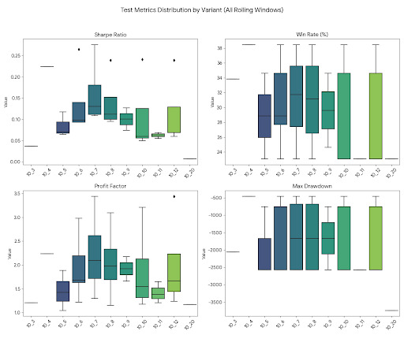
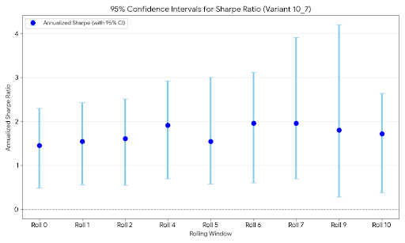
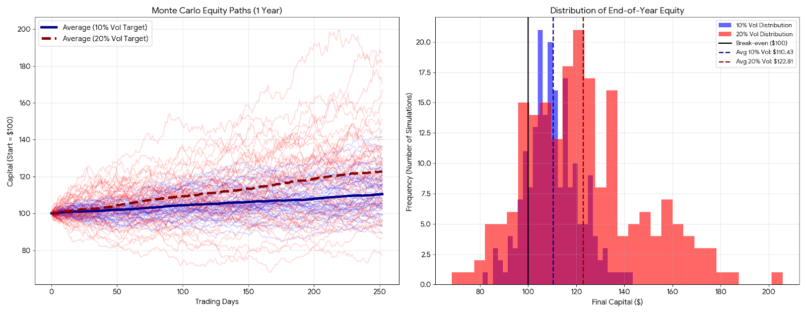
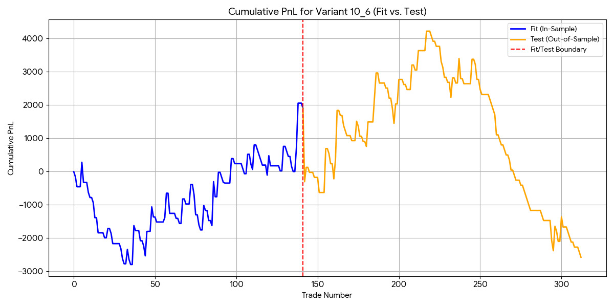

Modelo de trading que usa medias moveis, determinar o calculo de volume profile e operar suporte/resistencia no POC.
(Overfitado) "backtest and researching is like drinking and driving"

- Resolver situacao dos simbolos                                       OK
- Calcular Moving Average Crossings                                    OK
- Calcular Volume Profile                                              OK
- Plotar POC                                                           OK
- Add entry signals                                                    OK
- Fix decide_entry_direction                                           OK
- Calculate result from each entrie                                    OK
- Fix symbol with duplicate entries                                    OK
- Fix sharpe calculation                                               OK
- Add Costs                                                            OK
- Add Slippage                                                         OK
- Plot Entries stop and tp                                             OK
- Fix POC step (0.0005)                                                OK
- Fix moving Average  Mistake                                          OK
- Make Moving Average Fix Clean                                        OK
- Fix Sharpe Calculation                                               OK
- Review Trade Closing                                                 OK
- Review for other possible mistakes                                   OK
- Limit trades to same contract as vp                                  OK
- Add Metric Average Trade Duration                                    -
- Add Metric Avg Win                                                   OK
- Add Metric Avg Loss                                                  OK
- Add Metric Number of days                                            OK
- Fix metrics Total Trades                                             OK
- Control Trade Duration                                               OK
- Optimize load_data function
- Optimizacao: fazer compute_data e return from trades para todas variantes ao mesmo tempo
- Optimizar memoria
- Optimize volume profile function                                     OK
- Generate p&l graph function
- Fit and Test separated (out of sample)                               OK
- Fit and Test rolling out of sample                                   OK
- Add final date                                                       OK
- Returns in %                                                         OK
- Update Capital with trade results                                    OK
- In Sample Permutation Test
- Permutate_candles function
- Position Sizing with volatility standardization OK
- Ploting Standard Deviation                                           OK
- Stop size based on ATR                                               OK
- Fix instrument specifics(tick size, tick value, costs)               OK
- Fix volality in % not being handled                                  OK
- Handle 0 contracts situations                                        OK
- Trades bleeding across Contracts Add Switch
- Volatility scaling: you’re treating 1-hour STD as daily STD          OK
- Using Daily ATR                                                      OK
- Remove Zero-return days
- Avg Win / Avg Loss are wrong
- Fix Compute Data
- Tralling Stop instead of take profit
- Position Sizing with Forecast Value
